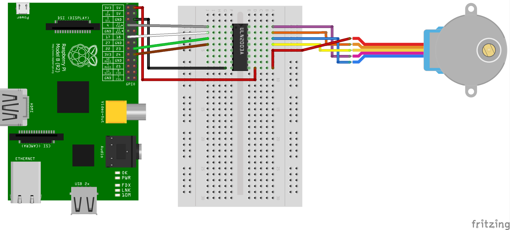
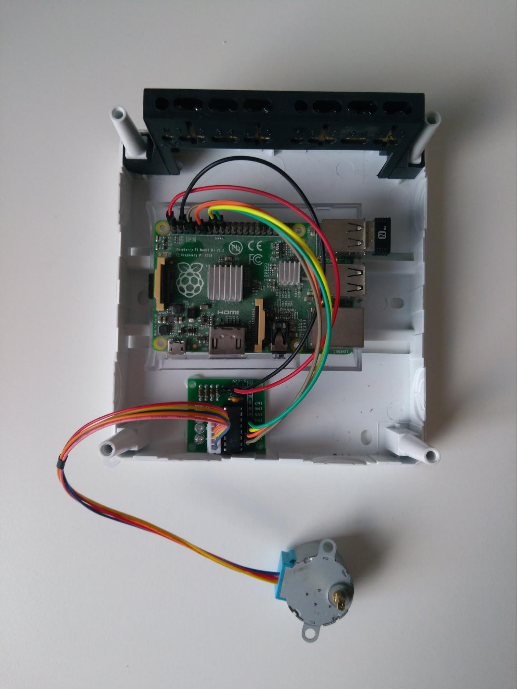
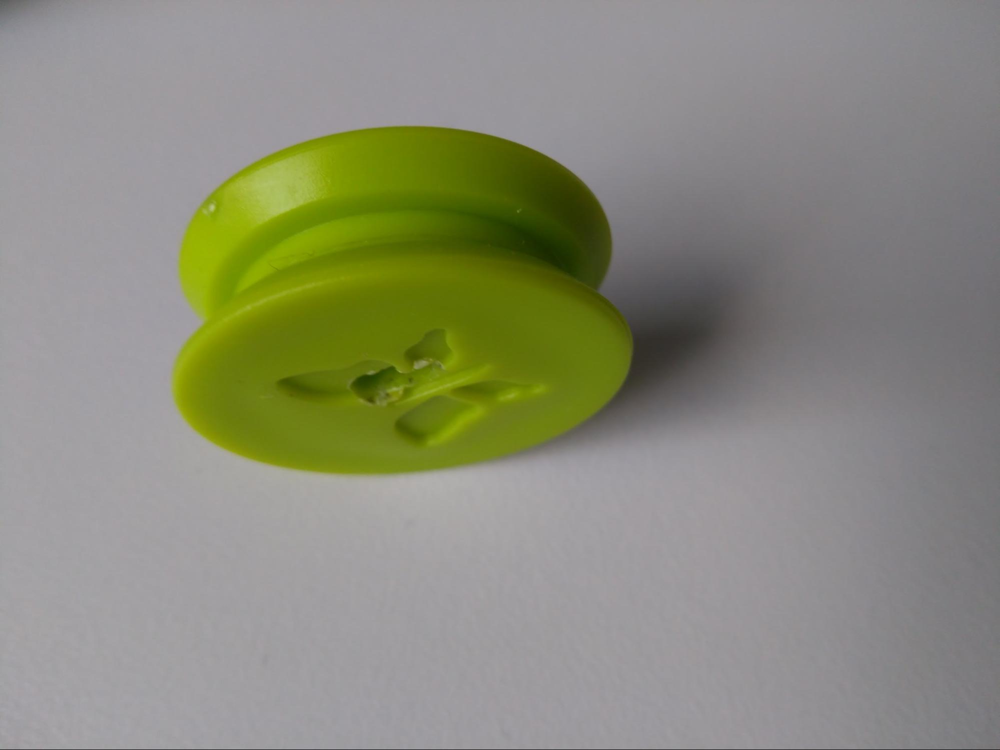
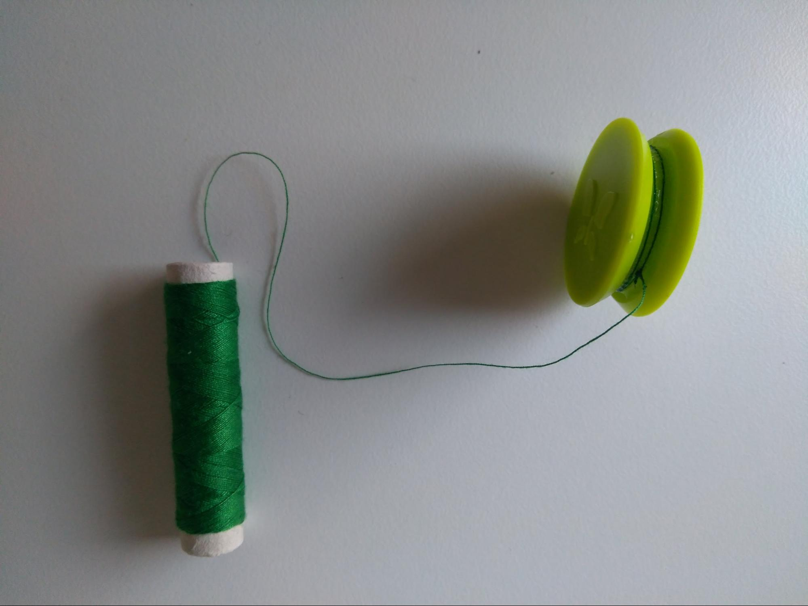
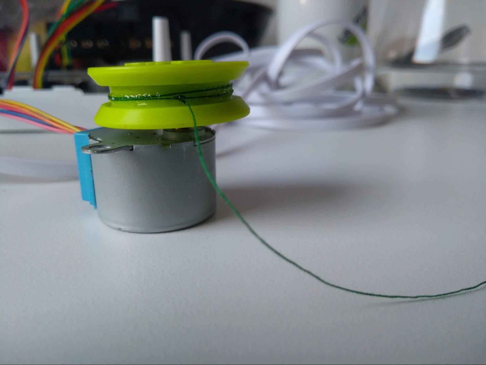
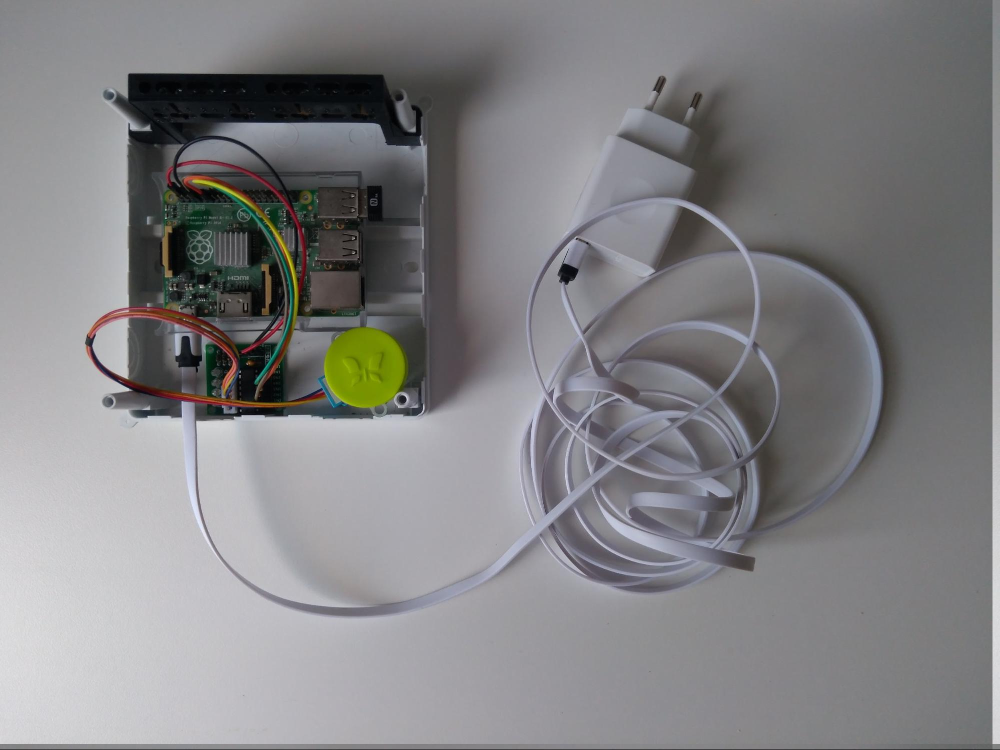
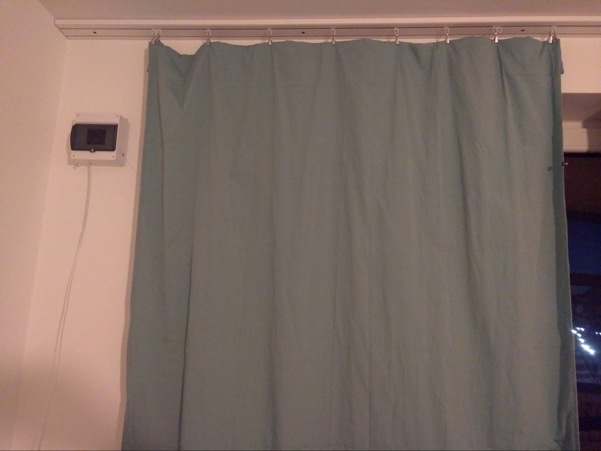
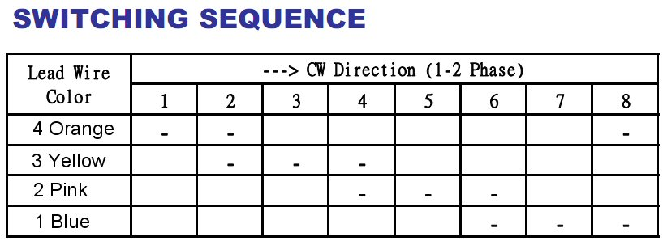

### Intro

As I like being woken up by sunrise and I also close my curtains every night before going to sleep, I needed a way to have them open automatically, without having to get up.

What I needed to achieve my goal was:

* raspberry Pi 2 with Wi-Fi over USB
* USB charger
* 3m USB cable
* stepper engine: 28BYJ-48 5V
* stepper engine driver: ULN2003 board
* 6 jumper cables
* a spool - I used a plastic one brutally ripped out of a toy I bought especially for the purpose
* a fishing line, alternatively any cord/thread
* 1 curtain clip
* glue
* a plastic box (I used an electrical junction box from a hardware store)

Aside from Raspberry Pi itself, each component is worth around $1.

### Hardware

Connecting a stepper engine to Raspberry Pi is trivial with ULN2003. I found a fantastic schema in a tutorial from tutorials-raspberrypi.de:

source: https://tutorials-raspberrypi.de/wp-content/uploads/2014/08/uln2003-Steckplatine.png

Since the ULN2003 board is already soldered together (as in the picture below), we don't need a bread board and the only vital part is connecting ULN2003 to:

* 5V power supply (red jumper cable)
* Ground (black jumper cable)
* 4 GPIO pins: 4, 17, 23, 24 consecutively.

After everything is connected, let’s glue it into the plastic box.

The stepper engine is going to roll up the cord in order to open the curtain, but for that we need a spool. Since it’s tricky to buy an actual spool that fits well into the box, I used a random part of a plastic toy that fit everything perfectly. It also happened to have a butterfly imprint, which adds a lot of charm to otherwise harsh image of development boards and jumper cables. I was forced to drill a hole in the middle of the butterfly’s wing though, so the stepper engine can be attached to it.

The cord needs to be glued to the spool.

After that, everything is attached to the stepper engine.

Almost everything is ready to be mounted on the wall - the last part is the USB charger along with a rather long USB cable. Isn’t the butterfly beautiful indeed?

The box is placed on the wall, and the loose cord should be attached with a curtain clip to the rightmost end of the curtain. The stepper motor is going to slowly roll up the cord, pulling the curtain open. After successfully mounting the curtain opener on a wall near the victim curtain, let’s get the software ready.

### Software

Fortunately, Raspberry Pi offers tons of useful drivers to handle its GPIO pins. I chose Python and the source code can be found here:
~~~
import RPi.GPIO as GPIO
import time
import sys
 
GPIO.setmode(GPIO.BCM)
pin1 = 4
pin2 = 17
pin3 = 23
pin4 = 24
 

delay = 0.001
count = 512

GPIO.setup(pin1, GPIO.OUT)
GPIO.setup(pin2, GPIO.OUT)
GPIO.setup(pin3, GPIO.OUT)
GPIO.setup(pin4, GPIO.OUT)
 
def do_step(s1, s2, s3, s4):
    GPIO.output(pin1, s1)
    GPIO.output(pin2, s2)
    GPIO.output(pin3, s3)
    GPIO.output(pin4, s4)
 
def forward(sequence, delay, steps):
    for _ in range(steps):
        for step in sequence:
            do_step(*step)
            time.sleep(delay)

sequence = [[1,0,0,0],[1,1,0,0],[0,1,0,0],[0,1,1,0],[0,0,1,0],[0,0,1,1],[0,0,0,1],[1,0,0,1]]
 
if __name__ == '__main__':
    if len(sys.argv) > 1:
        if sys.argv[1] == 'rev':
            sequence = [s for s in reversed(sequence)]
forward(sequence, delay, count)
~~~
https://gist.github.com/psarna/e93ceb5e03ed0a1de8c6edde24ab573e

https://github.com/psarna/gpio/blob/master/stepper.py

This code was tested on Raspbian 9 and arch.

Short explanation of what happens here. At first, we declare that we’re going to use BCM naming of pins - there’s also BOARD naming we can use and the differences are explained here: https://raspberrypi.stackexchange.com/questions/12966/what-is-the-difference-between-board-and-bcm-for-gpio-pin-numbering

At first we name our four pins we’re going to use in order to operate the stepper engine through ULN2003 driver. Numbers 4, 17, 23, 24 are implied by the actual pin numbers we used when connecting the stepper engine - if for any reason you’ve used other pins in previous steps, these are the numbers you need to adapt for the code to run properly.
Next parameters - delay and count. The stepper engine, as its name suggests, works one tiny steps at a time, and this particular model does 512 steps before reaching a full circle - as a result, setting 512 as the number of steps is going to force the engine to make a single full 360’ rotation. Delay is the number of seconds before setting GPIO pins to another steps. Too big a value will result in the engine not running at all (it usually just buzzes, which implies that steps come faster than they could actually be executed), and a value too low will result in, well, the engine taking ages to make a full rotation. I found 1ms to be a perfect value, but mileage may vary, especially if you use a $1 engine as I do - if the engine rotates, but in a weird way, or just buzzes angrily, try amending this value first.

*do_step()* is a helper function that sets appropriate values to our pins. *forward()* is another helper function that performs a single step and then waits a bit - that’s the heart of our engine software.

*sequence* - this absolutely magical array of numbers is the most important data structure in the whole project. Where do the values come from? Well, from the engine documentation. They can be obtained by googling “28byj-48 switching sequence”.

Source: https://os.mbed.com/cookbook/4-Phase-Step-Motor

That’s it, feeding the sequence to the engine via GPIO pins makes it spin, and that’s everything we need in order to get the curtain open. Also, if we feed the engine with reversed sequence, it rotates counter-clockwise, which is very handy in order to unroll the cord later. That’s what happens when we pass “rev” as a first argument to our program.

In order to adjust the software to the actual length of my curtains I could have make it accept an argument that changes the number of full rotations it needs to do, but all the previous work was hard enough and I solved this one the easy way - just run it in a loop in your shell several times, works like a charm!

In order to make sure that the curtains are open in the morning, a simple cron job will suffice. For one time testing, there’s also `at` utility, which is really handy to use:
$ echo for i in {1..16}; do python stepper.py rev; done | at 7:10 AM

### Demo

Spoiler alert: it works!

https://youtu.be/XwCiMABjWzk
